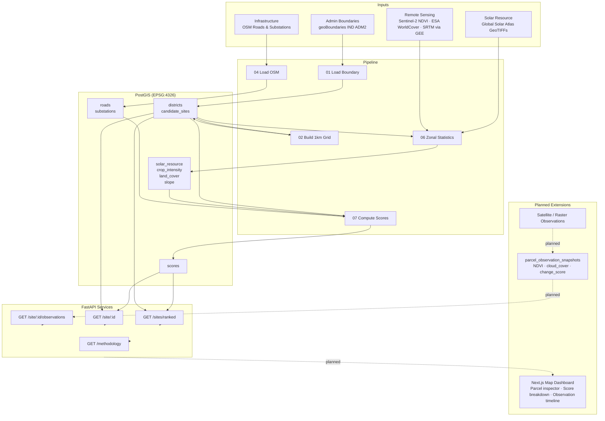

# Dhara Energy Map

A geospatial intelligence platform for screening distributed energy resource sites. Dhara combines PostGIS spatial data modeling, a deterministic scoring pipeline, and FastAPI services to rank candidate parcels by solar potential, infrastructure proximity, land suitability, and terrain constraints. The data model is designed to support future parcel-level monitoring and satellite/raster observation overlays.

**Current scope:** Anantapur district, Andhra Pradesh — ~1,100 candidate sites across a 1 km × 1 km grid.

---

## Architecture



---

## What It Does

1. **Grid generation** — Clips a 1 km × 1 km grid to the district boundary and keeps cells above 25 ha.
2. **Data ingestion** — Loads admin boundaries, OSM roads and substations, and raster layers (GHI, NDVI, WorldCover, SRTM) into PostGIS.
3. **Zonal statistics** — Extracts per-cell raster summaries (mean GHI, NDVI p75, slope, dominant land cover) using rasterio and rioxarray.
4. **Weighted scoring** — Normalizes each factor and combines them into a single ranked score per site with per-factor contributions exposed.
5. **REST API** — Serves ranked sites, site dossiers with full score breakdowns, and observation snapshots via FastAPI.

---

## Who It Is For

- Energy developers and EPCs screening sites for solar or agri-PV development
- Government planners assessing distributed energy potential at district scale
- Data engineers building spatial analytics pipelines on OpenStreetMap and public raster data
- Portfolio demonstration of PostGIS spatial modeling, raster processing, and FastAPI service design

---

## Data Model

Core tables (all geometries in EPSG:4326):

| Table | Purpose |
|---|---|
| `districts` | Admin boundary polygon |
| `candidate_sites` | 1 km × 1 km grid cells (UUID PK, area_ha, centroid, geom) |
| `roads` | OSM roads (highway class, surface, LineString geometry) |
| `substations` | OSM substations (voltage, operator, Point geometry) |
| `solar_resource` | GHI and PV output per site from Global Solar Atlas |
| `crop_intensity` | NDVI mean and p75 from Sentinel-2 via GEE |
| `land_cover` | ESA WorldCover class percentages per site |
| `slope` | SRTM elevation and slope statistics per site |
| `scores` | Normalized factor scores, per-factor contributions, total score, confidence |
| `parcel_observation_snapshots` | Timestamped raster/field observations per site (planned ingestion path) |

See [`docs/data_model.md`](docs/data_model.md) for full schema documentation.

---

## Site Scoring

Scoring is a transparent weighted additive model. Each factor is min-max normalized before weighting.

| Factor | Weight | Input | Direction |
|---|---|---|---|
| Solar GHI | 0.25 | `ghi_kwh_m2_day` | Higher is better |
| Substation proximity | 0.20 | Distance to nearest substation (km) | Closer is better |
| Road proximity | 0.15 | Distance to nearest road (km) | Closer is better |
| Slope penalty | 0.15 | `slope_mean_deg` | Flatter is better |
| Land suitability | 0.15 | `bare_sparse_pct` from WorldCover | Higher bare/sparse is better |
| Crop intensity | 0.10 | `ndvi_p75` | Lower is better (less active cropland) |

**Confidence score** starts at 0.8 and is reduced by 0.1 for each factor with missing input data, floored at 0.0. Sites with confidence below 0.5 should be treated as indicative only.

The `/methodology` endpoint documents current weights at runtime. The `/site/:id` response exposes individual factor norms and contributions.

---

## API Layer

Base URL: `http://localhost:8000`

| Endpoint | Description |
|---|---|
| `GET /health` | DB connectivity check |
| `GET /sites/ranked` | Ranked candidate sites (query: `limit`, `min_score`) |
| `GET /site/{site_id}` | Site dossier with full score breakdown |
| `GET /site/{site_id}/observations` | Parcel observation snapshots |
| `GET /methodology` | Scoring weights and CRS configuration |

See [`docs/api_examples.md`](docs/api_examples.md) for request/response examples.

---

## Demo Instructions

### Prerequisites

- Docker Desktop running
- Python 3.10+
- `psql` CLI available

### 1. Start the database

```bash
make db-up
make init-db
```

### 2. Install dependencies

```bash
make install
```

### 3. Load demo data (no GEE account required)

```bash
python scripts/seed_demo.py
```

This inserts 4 candidate sites, 2 substations, 2 roads, and pre-computed scores so the API is immediately queryable.

### 4. Start the API

```bash
make api
```

### 5. Explore

```bash
# Health check
curl http://localhost:8000/health

# Top sites by score
curl "http://localhost:8000/sites/ranked?limit=5"

# Site dossier with score breakdown
curl http://localhost:8000/site/<site_id>

# Scoring weights
curl http://localhost:8000/methodology
```

### Run the full data pipeline (requires GEE access and downloaded shapefiles)

```bash
make load-boundary
make make-grid
make load-osm          # fetches OSM via Overpass API
make gee-export        # starts async GEE tasks — download results from Google Drive
make zonal-stats       # run after GEE exports are downloaded
make compute-scores
make smoke-test
```

---

## Running Smoke Checks

```bash
# DB row counts and top-ranked sites
make smoke-test

# Backend imports and scoring logic
python scripts/09_smoke_api.py
```

---

## Current Limitations

- **Single district only.** The pipeline is parameterized for Anantapur. Multi-district support requires extending the boundary loading and grid generation scripts.
- **GEE dependency.** NDVI, WorldCover, and SRTM layers require a Google Earth Engine project and manual export. The seed script bypasses this with pre-computed demo values.
- **No frontend yet.** The Next.js map dashboard is planned. Current interaction is via the REST API.
- **WorldCover zonal stats incomplete.** Script `06_raster_to_zone_stats.py` has a TODO for WorldCover class distribution; the `land_cover` table is defined but not populated in the current pipeline run.
- **OSM data quality varies.** Substation coverage in rural India is sparse. Confidence scores account for missing infrastructure data.
- **No authentication.** The API has no auth layer. Intended for local/demo use only.

---

## Future Satellite / Raster Observation Path

The `parcel_observation_snapshots` table is included in the schema to support parcel-level monitoring workflows. The intended ingestion path is:

```
Satellite / raster observation (Sentinel-2, PlanetScope, etc.)
  → extract per-parcel statistics (NDVI, cloud cover, change score)
  → insert timestamped record into parcel_observation_snapshots
  → expose via GET /site/:id/observations
  → render as observation timeline in the map dashboard
```

This is a data model and API design decision, not a currently implemented satellite CV pipeline. Adding actual raster ingestion, change detection, or time-series analysis is out of scope for this project — that work belongs in a dedicated satellite analytics system.

---

## Data Sources

| Source | Layer | License |
|---|---|---|
| geoBoundaries IND ADM2 | Admin boundary | Open |
| OpenStreetMap via Overpass API | Roads, substations | ODbL |
| Global Solar Atlas v2 | GHI, PV output | Free public GIS |
| Sentinel-2 SR Harmonized via GEE | NDVI | Earth Engine terms |
| ESA WorldCover v200 | Land cover | CC BY 4.0 |
| SRTMGL1_003 via GEE | Elevation, slope | Public USGS |

See [`DATA_LICENSES.md`](DATA_LICENSES.md) for full attribution.

---

## Project Structure

```
dhara-energy-map/
├── backend/
│   └── app/
│       ├── main.py          # FastAPI app
│       ├── schemas.py       # Pydantic response schemas
│       ├── db.py            # SQLAlchemy engine
│       ├── settings.py      # Env config
│       └── routes/
│           ├── health.py
│           ├── sites.py
│           └── observations.py
├── scripts/
│   ├── 00_init_db.sql       # Schema DDL
│   ├── 01–07_*.py           # Data pipeline steps
│   ├── 08_smoke_test_db.py  # DB validation
│   ├── 09_smoke_api.py      # Backend import and scoring check
│   └── seed_demo.py         # Demo dataset loader
├── docs/
│   ├── data_model.md
│   └── api_examples.md
├── data/
│   ├── raw/                 # Boundaries, OSM, solar, GEE exports
│   └── processed/           # Rasters, vectors, tiles
├── docker-compose.yml       # PostGIS + Redis
├── Makefile
├── METHODOLOGY.md
└── DATA_LICENSES.md
```
